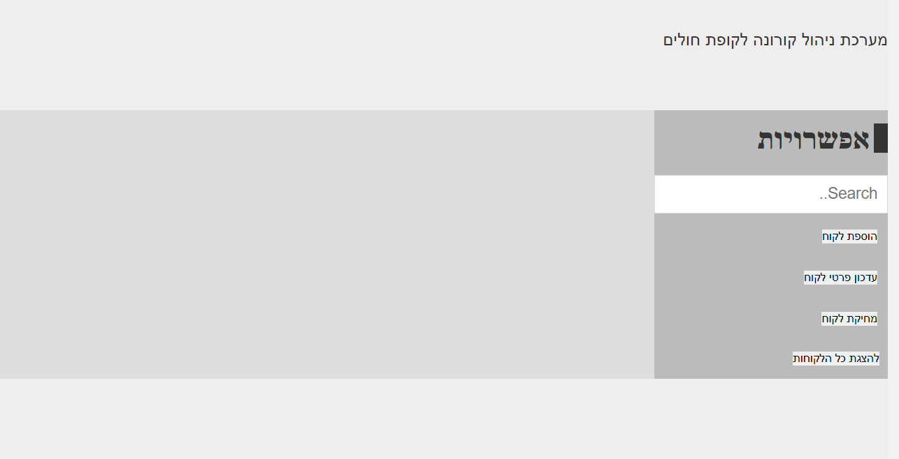
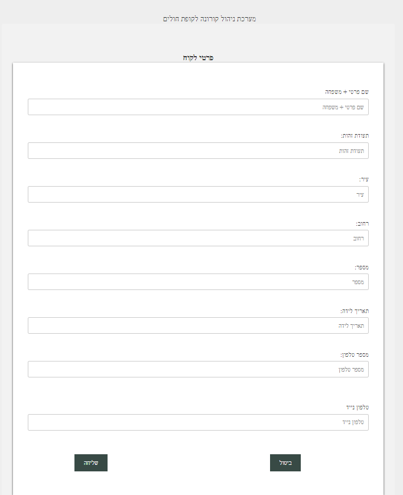
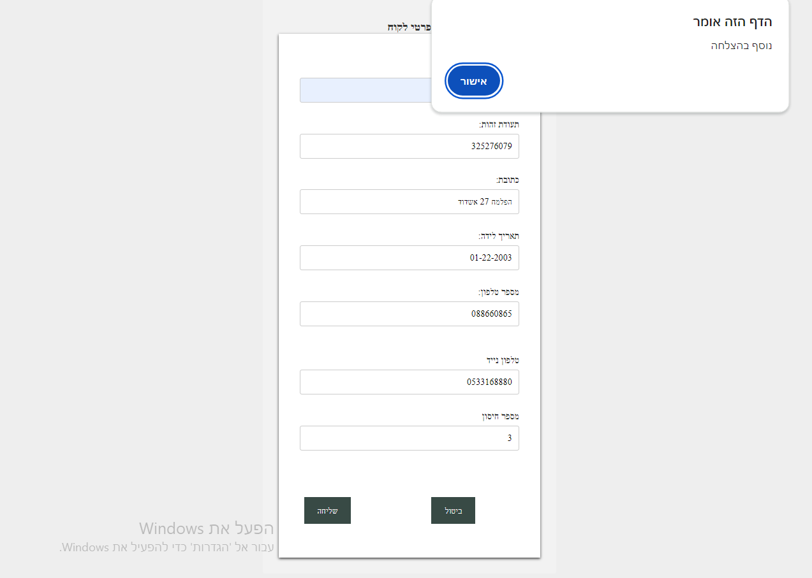
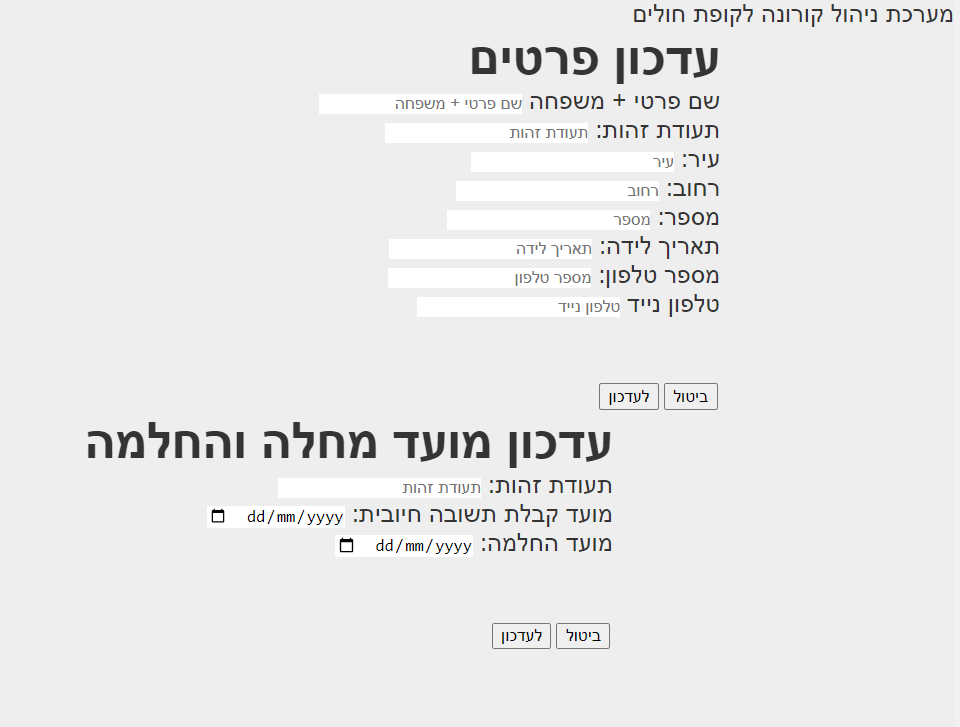
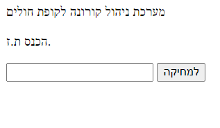
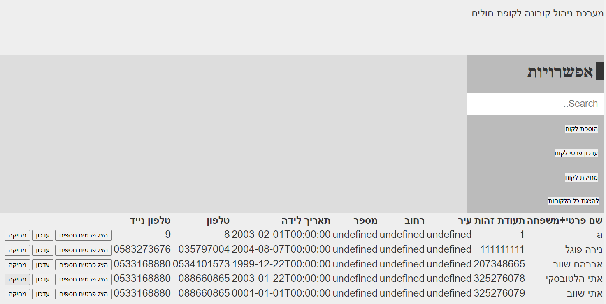
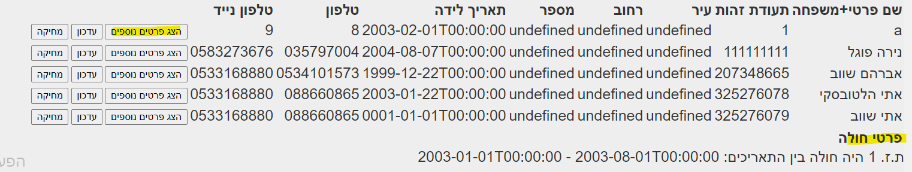
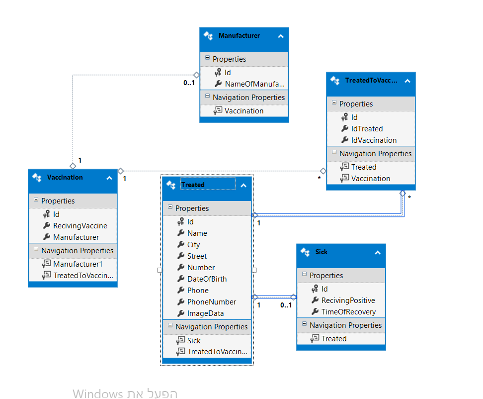

# Hadasim
Managing a database for Covid-19 patients

# external dependencies
## to run the program, you shold...
The system consists of a C# server side and a JS client side
To run the program you need to run the programs at the same time
By clicking on the green button called IIS EXPRESS (Google Chrome) in visual studio

# client-JS
A screen that includes the various options

Screen for adding a customer, the customer must enter his details and by clicking the send button - a check is made to see if there is a customer with such an identity number, if there is, a message will be displayed to the user about it, and if not, the customer will be added to the list of customers

An appropriate message will be displayed to the user

By clicking the button to update,
will reach this screen,
Here you enter the identity number, and by pressing the send button, you retrieve the data of that respective customer
Then you can update the desired data

By pressing the delete button,
Enter the desired ID number and delete it

By clicking on to display all customers,
Pulls all the customers from the DB from the customer table and shows them to me on the screen 

By clicking on button showMoreDetails,
it's show the sick details.

 

# Server-c#

We have several tiers on the server side
The API layer, the BL layer, the DAL layer and the DTO layer

A software system is built from several layers, each layer has a defined role.
A layer can be a physical layer (Tier) or a logical layer (Layer) but we will discuss that later.
The classic model of distribution talks about three layers (although there can be more layers):
Presentation Layer - User Interface (UI- User Interface) layer.
The display layer consists of windows and controls in windowed applications or HTML pages on websites.
The layer communicates between the user and the other layers of the system.
The business logic layer (BL - Business Logic) - the layer that is responsible for the logic of the system, deals with processing the information, with various calculations and sending it to the display layer.
In this layer we will realize the functionality of the system.
The data layer (Data Access Layer - DAL) - This layer consists of one or more data sources, the data sources can be databases, XML files, text files, log files... and a software system whose job is to read the information required by the system , save the updates, and add new information or delete existing information (also called CRUD- Create, Read, Update, Delete).
In many cases (perhaps most) the layers themselves are divided into additional sub-layers, in the following figure you can see that the data layer is divided into two sub-layers: data sources (database, XML file) and a layer that links the system and the database (on which we will focus in this series of articles).
The three-layer model is a basic and very common model in the industry, on which other models are based that expand and improve it.
Other models are often based on the same three layers, only expanding them as needed.

**architecture:**
The project is divided into 3 main layers:
Server side layer which is divided into 4 main layers:
There is the API layer that communicates with the client
It includes routing of the function
There is the BL layer which is the logical layer
There is the DAL layer where the function is implemented and there is the conversion layer which is the DTO layer that contains the objects
A client-side layer that communicates with the user
and the database layer that contains all the data
All these layers make up the project
And it depends on them all together.

# DB-SQL 

